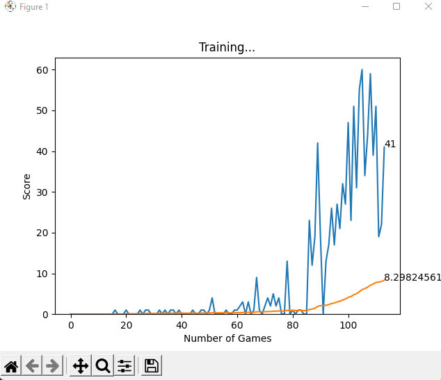

# Snake-AI

A Snake AI using the Reinforcement Learning and [Deep Q-Learning Algorithm](https://towardsdatascience.com/deep-q-learning-tutorial-mindqn-2a4c855abffc#:~:text=Deep%20Q%2DLearning%20uses%20Experience,to%20train%20after%20each%20step.) by replaying models in each epoch.

Built with the [Pygame](https://www.pygame.org/news) and [Pytorch](https://pytorch.org/) libraries.

Preivous models are stored in `./model`.

